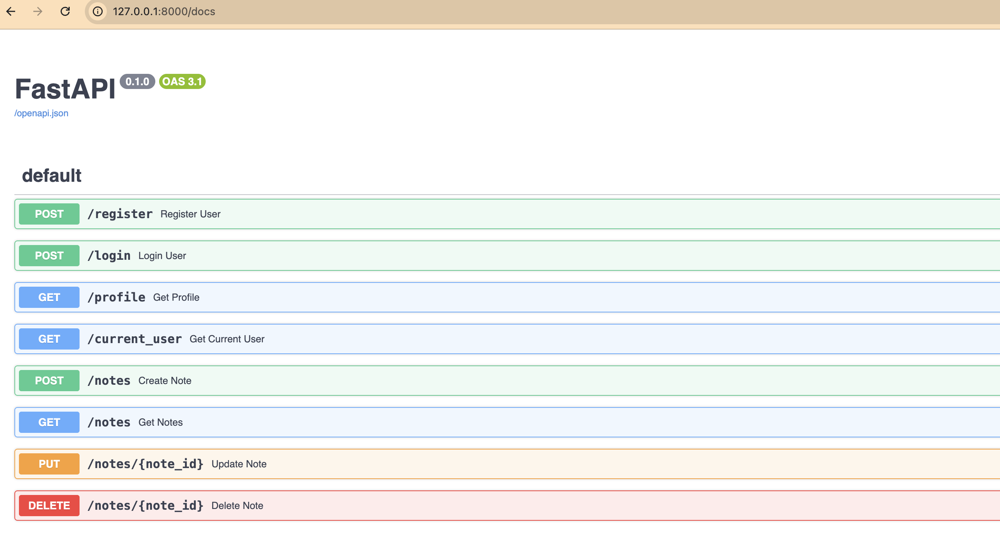

# SaaS Backend Foundation

A backend foundation built with FastAPI, PostgreSQL, and SQLAlchemy while learning production backend architecture.

## Screenshots

## Screenshot

## What it includes

- User registration and authentication
- JWT-based authentication
- Password hashing with Argon2
- User and Note relationships
- CRUD operations for notes
- PostgreSQL database integration
- Alembic database migrations
- Environment-based configuration

## Tech Stack

- Python
- FastAPI
- PostgreSQL
- SQLAlchemy
- Alembic
- Pydantic
- JWT
- Argon2

## Project Structure